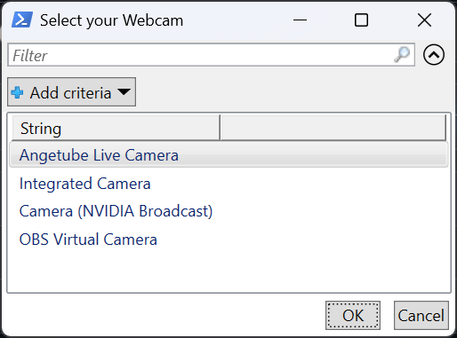
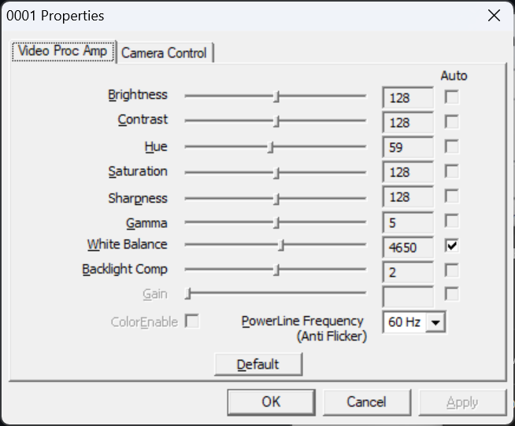

 

This is a small script I made to launch the the default webcam settings dialog window in Windows, a native control panel interface for adjusting camera properties. This specific dialog allows users to manually configure settings such as brightness, contrast, hue, saturation, sharpness, gamma, white balance, and backlight compensation using sliders and numerical inputs. 
This system dialog is often accessed through specific software (like OBS or StreamLabs) that uses the Windows API, as it is not easily accessible through the standard Windows Settings menu alone

This is nowhere near perfect, I made this in 15 minutes. If you can make it better, please do! The files are heavy because of the ffmpeg executable needed for this to work.

# How to use

## 1. Download
Download the files and place them in a folder somewhere on your computer. Ensure `ffmpeg.exe` is in the same folder.

## 2. Run the script to choose camera
Double-click **Launch.vbs** or run webcamdialog.bat

* **One Camera:** The settings dialog will appear instantly.
* **Multiple Cameras:** A window will pop up listing your cameras. Click one and press OK.

*Note: You no longer need to manually edit files or look up your camera name; the script handles it for you*

## 3. Place a shortcut on your desktop (optional)
You can create a shortcut to `WebcamSettings.bat` on your desktop for quick access.

Voila! Hope it works for you.
